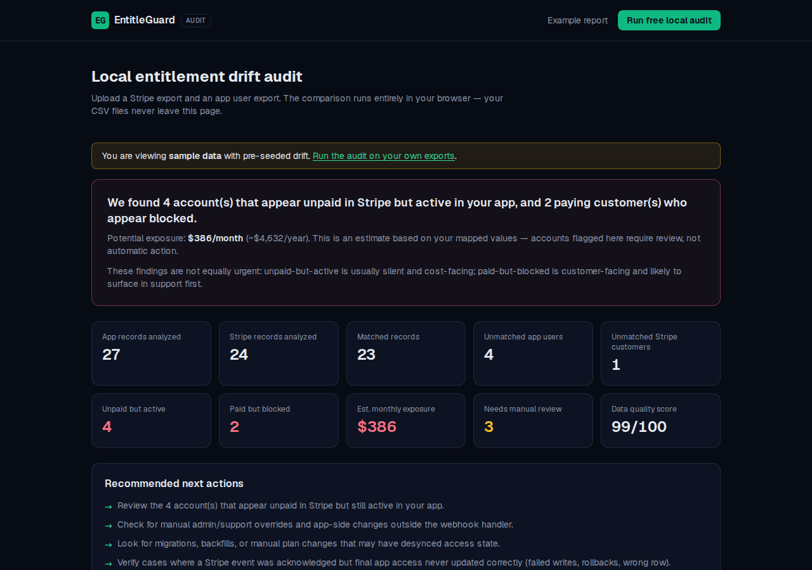

# EntitleGuard Audit

Local-first **Stripe-to-app-access reconciliation auditor for usage-heavy B2B SaaS**. Read-only by design: it finds mismatches and produces a reconciliation report; it never patches, suspends, or writes anything.

Upload a Stripe export CSV and an app entitlement export CSV. The tool compares them **entirely in the browser** and reports potential entitlement drift: unpaid-but-active users, paid-but-blocked customers, missing billing links, orphaned subscriptions, and ambiguous cases — with estimated monthly exposure.

**Initial focus:** Stripe + Postgres-style CSV exports (users or workspaces table). Nightly API-based reconciliation is in beta.

**Live app:** [entitleguard.amertech.online](https://entitleguard.amertech.online) · [Example report](https://entitleguard.amertech.online/audit?demo=1)



## Who this is not for

EntitleGuard is intentionally narrow. It is probably not useful for:

- Apps that check Stripe live on every request and do not keep local entitlement state.
- Very early SaaS products with a handful of customers and no meaningful usage cost.
- Teams looking for a webhook retry queue, dead-letter replay tool, or automatic suspension system.
- Companies that need vendor-hosted procurement, SOC 2 review, or enterprise SSO before running any audit.

## What this is not

EntitleGuard is **not a webhook retry tool**.

Webhook queues, idempotency, replay, and backfills help ensure events are processed. EntitleGuard checks the **result**: does your **current** app access state actually agree with Stripe's **current** billing state?

It catches cases where the webhook returned 200, but the DB row never ended up reflecting the correct state — failed writes, rollbacks, manual CS overrides, migrations, or later internal changes. It also catches drift that lazy "sync on page view" never heals, because the user never opens the billing page but keeps hitting your API.

This is **final-state reconciliation**, not webhook observability.

## Two layers

Mature Stripe integrations usually need both:

1. **Webhook reliability** — did we receive and process the Stripe event correctly? Queues, idempotency, and replay help here.
2. **Final-state reconciliation** — does your **current** app access state agree with Stripe's **current** billing state? EntitleGuard checks this result, regardless of how you got there.

Lazy sync on page view only heals accounts that open the billing page again. It does not catch users who keep hitting your API while Stripe says canceled, manual CS/admin overrides, or acknowledged-but-not-reflected cases where the webhook returned 200 but the access row never updated.

## Minimal export SQL

The recommended app export contains only pseudonymous IDs, statuses, and plans — no names or emails. Adapt table/column names to your schema.

**Users table** (per-user billing):

```sql
SELECT
  id AS internal_user_id,
  stripe_customer_id,
  subscription_status,
  plan,
  access_enabled
FROM users;
```

**Workspaces table** (team/org billing):

```sql
SELECT
  id AS workspace_id,
  stripe_customer_id,
  subscription_status,
  plan,
  access_enabled
FROM workspaces;
```

Export the columns your **request path actually reads** for access decisions. If middleware checks a boolean and a cron checks a status column, include both — the audit flags rows where your own columns disagree.

## What's next after the free audit

The free CSV audit is a one-time reconciliation. If you find drift, the next step is keeping it from coming back:

- **Monitoring beta** ($79/month, planned):
  - Nightly Stripe ↔ app diff
  - **Two alert tiers:** urgent (Category B — paid but blocked) vs review queue (A/C/D/E)
  - Flag only — never auto-fix by default
  - Slack/email alerts and a human review queue
  - Many teams only want continuous checks after their first incident
- **Manual leak audit** ($150): human review of your findings — free if we find nothing
- **15-minute drift review**: quick call to interpret results and plan remediation

Join via the CTAs on the [audit results page](https://entitleguard.amertech.online/audit).

## Privacy model

- CSV files are parsed and reconciled client-side (Web Worker). They are never sent to our servers.
- Minimal export by design: the copy-paste SQL exports only internal ID, Stripe customer ID, status, plan, and access flag — no names or emails. Email is an optional fallback join key for databases that don't store `stripe_customer_id`.
- No Stripe API keys, no database credentials, no login.
- The server only ever receives: analytics events (scalar props), and — after explicit consent — contact details plus an aggregate audit summary (counts and bucketed exposure, no identifiers).
- Local-only processing removes vendor exposure, but exporting customer records remains the user's own GDPR/data-policy responsibility — the UI states this explicitly.

## Stack

- Next.js (App Router) + TypeScript + Tailwind CSS v4
- PapaParse for CSV parsing
- Pure-TypeScript reconciliation engine (`src/lib/engine`) — framework-free, unit-tested
- SQLite (better-sqlite3 + Drizzle) for lead capture and analytics
- Vitest for engine tests

## Getting started

No setup required — [run the free audit in your browser](https://entitleguard.amertech.online/audit).

To run locally:

```bash
npm install
npm run dev
```

Open http://localhost:3000. Use **See example report** for a demo with bundled sample data (`public/samples/`).

## Scripts

| Command             | Purpose                          |
| ------------------- | -------------------------------- |
| `npm run dev`       | Development server               |
| `npm run build`     | Production build                 |
| `npm test`          | Engine unit + integration tests  |
| `npm run lint`      | ESLint                           |
| `npm run typecheck` | TypeScript check                 |

## Deploy (Coolify / Docker)

The repo ships a multi-stage `Dockerfile` (Next.js standalone output, ~minimal Alpine runtime) and a `docker-compose.yml` ready for Coolify:

1. In Coolify, add a new resource → **Docker Compose** pointing at this repo.
2. Coolify picks up the `SERVICE_FQDN_ENTITLEGUARD_3000` magic variable and auto-assigns a subdomain from your wildcard domain (Cloudflare wildcard → Coolify proxy handles TLS and routing). Override the generated FQDN in the service settings if you want e.g. `entitleguard.yourdomain.com`.
3. The named volume `entitleguard-data` persists the SQLite database (`/data/entitleguard.db` — leads, audit summaries, analytics) across deploys.

### Admin page

A read-only dashboard at `/admin` lists captured leads (with their aggregate
audit summaries), the analytics event funnel, and landing traffic sources.
It is protected by HTTP Basic auth: set the `ADMIN_PASSWORD` environment
variable (in Coolify: service → Environment Variables) and log in as user
`admin`. If `ADMIN_PASSWORD` is not set, `/admin` returns 404.

To run it anywhere else:

```bash
docker compose up -d --build
```

The container listens on port 3000 (not published to the host by default — Coolify's proxy attaches over the Docker network).

## Project layout

- `src/lib/engine/` — CSV parsing, column auto-detection, status normalization, tiered matching, category A–E classification, leakage estimation, masking
- `src/lib/export-sql-templates.ts` — minimal users/workspaces export SQL
- `src/workers/reconcile.worker.ts` — runs the engine off the main thread
- `src/components/audit/` — upload → mapping → run → results wizard
- `src/app/api/leads`, `src/app/api/events` — zod-validated lead capture and analytics (SQLite at `.data/entitleguard.db`)
- `public/samples/` — demo CSVs with pre-seeded drift
