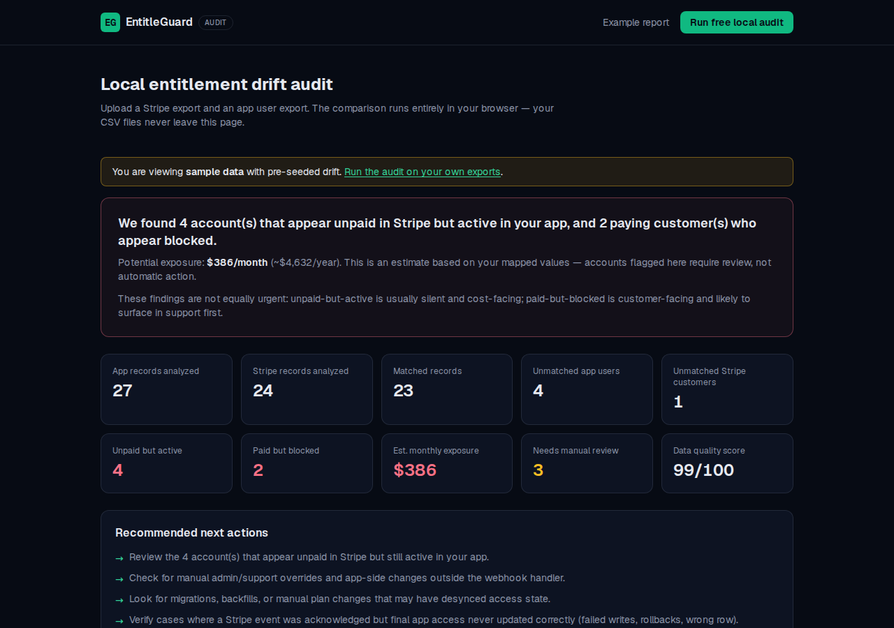

# EntitleGuard

**Know when a paying customer loses access before support tells you.**

EntitleGuard is a read-only Stripe-to-app-access auditor for SaaS teams that keep entitlement state in their own database. It compares Stripe billing state with the access state the application actually uses and reports paid-but-blocked customers, unpaid-but-active accounts, missing billing links, orphaned subscriptions, ambiguous states, and explicit manual overrides.

The current public product is a **free one-time local audit**: upload a Stripe export CSV and an app entitlement export CSV, and the comparison runs entirely in the browser. The monitoring beta is under active development.

**Live app:** [entitleguard.amertech.online](https://entitleguard.amertech.online) · [Example report](https://entitleguard.amertech.online/audit?demo=1)



## Monitoring beta direction

The beta is centered on operational alerts rather than a dashboard people may forget to inspect:

- **Critical access alert:** page when `paid-but-blocked >= 1`.
- **Drift alert:** compare the current mismatch rate with one fixed historical reference run, normally the same weekday about four weeks earlier. Do not use a rolling mean that can silently absorb a slow degradation.
- **Queue-age alert:** warn when unresolved mismatches remain open beyond the configured age threshold.
- **Acknowledgement and history:** alerts must be owned, acknowledged, and preserved rather than merely displayed.
- **Override provenance:** intentional exceptions should record who decided, why, when, and optionally when the override expires.
- **Read-only by default:** no automatic access grant or revocation.

The current implementation includes persistent jobs and runs, finding observations and lifecycle, fixed-reference alert evaluation, authenticated run ingestion, alert deduplication, monitoring-job bootstrap/configuration, aggregate operator read APIs, a retry-safe nightly scheduler, a customer-owned HTTPS source-adapter contract, Resend or SMTP email delivery, an authenticated production canary source, alert acknowledgement/resolution provenance, and a minimal operator UI.

## Monitoring job bootstrap and operator API

Set `MONITORING_OPERATOR_TOKEN` to enable the private operator endpoints. They require `Authorization: Bearer <token>` and return `404` while the token is unset.

Create a job with `POST /api/monitoring/jobs`:

```json
{
  "name": "Production subscriptions",
  "schedule": "nightly",
  "paidBlockedThreshold": 1,
  "driftRateIncreaseBps": 100,
  "queueAgeThresholdHours": 168,
  "referenceAgeDays": 28,
  "referenceToleranceDays": 7
}
```

Available operator endpoints:

- `GET /api/monitoring/jobs` — list jobs with health, latest-run aggregates, active-alert counts, and open-finding counts.
- `POST /api/monitoring/jobs` — bootstrap a job and its alert thresholds.
- `GET /api/monitoring/jobs/{jobId}?runs=30` — read one job, recent runs, active alert incidents, queue age, and category counts.
- `PATCH /api/monitoring/jobs/{jobId}` — change the name, schedule, active/paused state, or alert thresholds.
- `PATCH /api/monitoring/alerts/{alertId}` — acknowledge or resolve one alert incident with actor and optional note provenance.

Example alert action:

```json
{
  "action": "acknowledge",
  "actor": "on-call@example.com",
  "note": "Investigating the entitlement write path"
}
```

The operator responses deliberately omit finding fingerprints and all raw entitlement identities. They expose only job configuration, aggregate run state, alert candidates, counts, timestamps, and operator provenance. Use a separate operator token from the ingestion token so a source adapter cannot reconfigure its own monitoring policy.

## Monitoring operator UI

`/admin/monitoring` is protected by the same HTTP Basic authentication as `/admin`. It shows:

- current job health and latest-run aggregates;
- paid-but-blocked count, mismatch rate, actionable queue size, and oldest unresolved age;
- active alert incidents with acknowledge and resolve forms;
- recent monitoring runs and alert history;
- acknowledgement and resolution actor, timestamp, and notes.

Set `MONITORING_OPERATOR_NAME` to the name or email written by UI actions. It defaults to `admin`. Resolving an alert does not alter customer access; it closes only the monitoring incident. If the underlying condition remains present in the next complete run, a new incident opens.

## Monitoring run ingestion

`POST /api/monitoring/runs` persists one completed run. The endpoint is disabled unless `MONITORING_INGEST_TOKEN` is configured and requires `Authorization: Bearer <token>`.

A monitoring job must already exist. Each request supplies a caller-generated idempotency key and stable 64-character SHA-256 or HMAC fingerprints; keyed HMAC fingerprints are preferred. Raw customer emails, Stripe customer IDs, internal user IDs, and CSV rows are rejected by the strict payload schema.

```json
{
  "jobId": 1,
  "idempotencyKey": "2026-08-01-nightly",
  "source": "scheduled",
  "completeSnapshot": true,
  "startedAt": "2026-08-01T00:00:00.000Z",
  "completedAt": "2026-08-01T00:00:12.000Z",
  "totalAppRecords": 500,
  "totalStripeRecords": 498,
  "findings": [
    {
      "fingerprint": "aaaaaaaaaaaaaaaaaaaaaaaaaaaaaaaaaaaaaaaaaaaaaaaaaaaaaaaaaaaaaaaa",
      "category": "B",
      "direction": "grant",
      "severity": "high"
    }
  ]
}
```

Ingestion is atomic and implements these lifecycle rules:

- `completeSnapshot: true` is mandatory because an absent fingerprint is interpreted as a resolved finding; partial snapshots are rejected.
- Repeated idempotency keys do not create duplicate runs or observations.
- A recurring finding updates `last_seen_at`; a resolved finding that reappears starts a new incident age.
- Findings absent from the latest run are resolved while immutable per-run observations remain available.
- Active manual overrides are preserved but excluded from actionable mismatch rate and queue age until they expire.
- Repeated alert triggers update one active incident and increment its occurrence count.
- When a condition clears, the active alert is resolved; a later recurrence opens a new incident.

## Nightly scheduler, source adapter, and email

Set `MONITORING_SCHEDULER_TOKEN` to enable `POST /api/monitoring/scheduler/run`. An external cron invokes this endpoint once per night; EntitleGuard then claims each active nightly job once for the current UTC date.

For every claimed job, EntitleGuard calls the globally configured `MONITORING_SOURCE_URL` over HTTPS. The customer-owned source adapter returns a complete pseudonymous snapshot, so EntitleGuard never needs database credentials or raw entitlement identities.

The scheduler persists execution claims and retryable email deliveries. A failed source or email attempt can be retried without duplicating the monitoring run. Critical paid-but-blocked alerts repeat nightly while still open; warning alerts notify only when a new incident opens. Acknowledged critical incidents stop repeating.

See [docs/monitoring-scheduler.md](docs/monitoring-scheduler.md) for the source request/response contract, built-in canary, environment variables, cron example, retry behavior, and email policy.

## Who this is not for

EntitleGuard is intentionally narrow. It is probably not useful for:

- Apps that check Stripe live on every request and do not keep local entitlement state.
- Very early SaaS products with a handful of customers and no meaningful support or usage cost.
- Teams looking for a webhook retry queue, dead-letter replay tool, or automatic suspension system.
- Large engineering teams that prefer to build and maintain a custom reconciler around deeply bespoke entitlement rules.
- Companies that require enterprise procurement, SOC 2 review, or enterprise SSO before a beta trial.

The likely buyer is a team where paid-but-blocked incidents already enter a support queue and consume engineering or support time, but nobody wants to own the monitoring job permanently.

## What this is not

EntitleGuard is **not a webhook retry tool**.

Webhook queues, idempotency, replay, and backfills help ensure events are processed. EntitleGuard checks the result: does the application's **current access state** agree with Stripe's **current billing state**?

It catches cases where a webhook returned 200 but the database never ended up reflecting the correct state: failed writes, rollbacks, wrong-row updates, migrations, manual changes, or later internal overwrites.

This is final-state reconciliation used as an access-reliability signal.

## Direction-aware reconciliation policy

Grant and revoke mismatches do not have the same blast radius:

- **Grant direction:** Stripe says paid/active while the app blocks access. A single verified case is urgent because a paying customer cannot use the product.
- **Revoke direction:** Stripe says canceled/unpaid while the app still grants access. Do not revoke from one observation. Require repeated agreement and human review.
- **Manual overrides:** comped, hand-granted, or manually blocked accounts should carry an explicit override flag and provenance instead of being repeatedly treated as unexplained drift.

Monitoring must retain every observation. Silent healing without history hides the fact that an access path is degrading.

## Minimal export SQL

The recommended app export contains only pseudonymous IDs, statuses, and plans. Adapt table and column names to your schema.

**Users table:**

```sql
SELECT
  id AS internal_user_id,
  stripe_customer_id,
  subscription_status,
  plan,
  access_enabled
FROM users;
```

**Workspaces table:**

```sql
SELECT
  id AS workspace_id,
  stripe_customer_id,
  subscription_status,
  plan,
  access_enabled
FROM workspaces;
```

Export the columns the request path actually reads for access decisions. If middleware checks a boolean while another process checks a status column, include both so internal contradictions can be detected.

For intentional exceptions, also export recognizable optional columns such as:

```sql
manual_access_override,
manual_override_reason
```

Accepted override values include `true`/`false`, `1`/`0`, and `yes`/`no`.

## Privacy model

### Free local audit

- CSV files are parsed and reconciled client-side in a Web Worker.
- Files are never sent to the EntitleGuard server.
- No Stripe API keys, database credentials, or login are required.
- The server receives analytics scalars and, only after explicit consent, contact details plus an aggregate audit summary.

### Monitoring beta

- The monitoring data path is explicit and read-only.
- Findings use stable pseudonymous fingerprints rather than raw customer or user identifiers.
- Raw CSV rows are not part of the server-side monitoring schema.
- Operator responses do not return stored fingerprints.
- Alert emails contain aggregate incident state only.
- The customer-owned source adapter expresses entitlement truth without sharing database credentials.
- A design partner may still need a small adapter because entitlement truth lives in the customer's own schema; minimizing that integration burden is a core beta constraint.

## Stack

- Next.js App Router, TypeScript, React, and Tailwind CSS v4
- PapaParse for CSV parsing
- Pure-TypeScript reconciliation engine in `src/lib/engine`
- Monitoring ingestion, lifecycle, operator, scheduler, source-adapter, and alert logic in `src/lib/monitoring`
- SQLite with better-sqlite3 and Drizzle
- Resend HTTPS API or authenticated SMTP for alert email
- Vitest

## Getting started

```bash
npm install
npm run dev
```

Open `http://localhost:3000`. Use **See example report** for bundled sample data in `public/samples/`.

## Scripts

| Command | Purpose |
| --- | --- |
| `npm run dev` | Development server |
| `npm run build` | Production build |
| `npm test` | Unit and integration tests |
| `npm run lint` | ESLint |
| `npm run typecheck` | TypeScript check |

## Deploy with Coolify or Docker

The repository includes a multi-stage `Dockerfile` and `docker-compose.yml`.

1. In Coolify, add a Docker Compose resource pointing at this repository.
2. Configure the generated FQDN or override it with the intended domain.
3. Keep the `entitleguard-data` named volume mounted so the SQLite database at `/data/entitleguard.db` persists across deploys.
4. Set a strong `MONITORING_OPERATOR_TOKEN` to enable private job configuration/read/action endpoints.
5. Optionally set `MONITORING_OPERATOR_NAME` for UI action provenance.
6. Set a different strong `MONITORING_INGEST_TOKEN` only when the private run-ingestion endpoint should be enabled.
7. Configure `MONITORING_SCHEDULER_TOKEN`, `MONITORING_SOURCE_URL`, optional `MONITORING_SOURCE_TOKEN`, `MONITORING_ALERT_TO`, and `MONITORING_ALERT_FROM` for nightly monitoring. Configure either `RESEND_API_KEY` or the SMTP variables documented in `docs/monitoring-scheduler.md`.
8. Add a nightly cron request to `POST /api/monitoring/scheduler/run` with the scheduler bearer token.

Run elsewhere with:

```bash
docker compose up -d --build
```

The container listens on port 3000.

## Admin page

The `/admin` dashboard lists captured leads, aggregate audit summaries, analytics funnel events, and landing traffic sources. `/admin/monitoring` is the minimal monitoring operator UI. Both are protected by HTTP Basic authentication through `ADMIN_PASSWORD`. If the variable is unset, `/admin` routes return 404.

## Project layout

- `src/lib/engine/` — parsing, mapping, normalization, matching, classification, leakage estimation, masking
- `src/lib/monitoring/` — run ingestion, finding lifecycle, fixed-reference selection, job configuration, operator read models, alert actions, nightly scheduling, email delivery, and alert evaluation
- `src/lib/export-sql-templates.ts` — minimal users/workspaces export SQL
- `src/workers/reconcile.worker.ts` — browser-side reconciliation worker
- `src/components/audit/` — upload, mapping, run, and results flow
- `src/db/` — SQLite schema for leads, analytics, monitoring jobs, runs, findings, observations, alerts, scheduler claims, and email deliveries
- `src/app/admin/monitoring` — Basic-authenticated operator UI and server actions
- `src/app/api/monitoring/jobs` — authenticated job bootstrap, configuration, and aggregate operator read endpoints
- `src/app/api/monitoring/alerts` — authenticated acknowledgement and resolution endpoint
- `src/app/api/monitoring/runs` — authenticated, strict, pseudonymous run-ingestion endpoint
- `src/app/api/monitoring/scheduler/run` — authenticated nightly scheduler trigger
- `docs/monitoring-scheduler.md` — source-adapter and delivery contract
- `src/app/api/leads`, `src/app/api/events` — validated lead capture and analytics
- `public/samples/` — demo CSVs with pre-seeded drift
